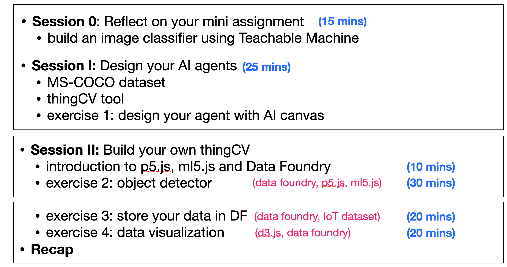

## Objective of the Workshop
This AI workshop was given in the TU/e Industrial Design department in the ARTIFICE squad. The aim of this workshop is to guide students to get familiar with data, tools and libraries through serveral hands-on exercises. After this workshop, students are able to further consolidate their ideas and turn them into practice and create prototypes with data, AI and their creativitiy.

## Workshop Structure

## System Workflow

## Detailed Overview of Each Compoment in the System
- Object detector (using DF, p5.js and ml5.js) with a pre-trained model (i.e., COCOSD or YOLO)
- Data storage (using DF)
- Data visualizer (using DF and d3.js)

Slides: [here](slides/ARTIFICE_AI_workshop_20231011.pdf)
